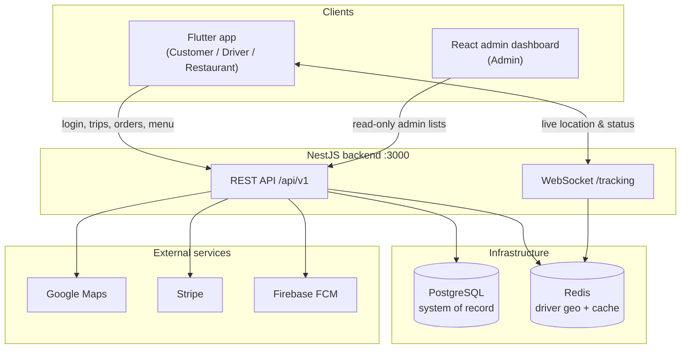
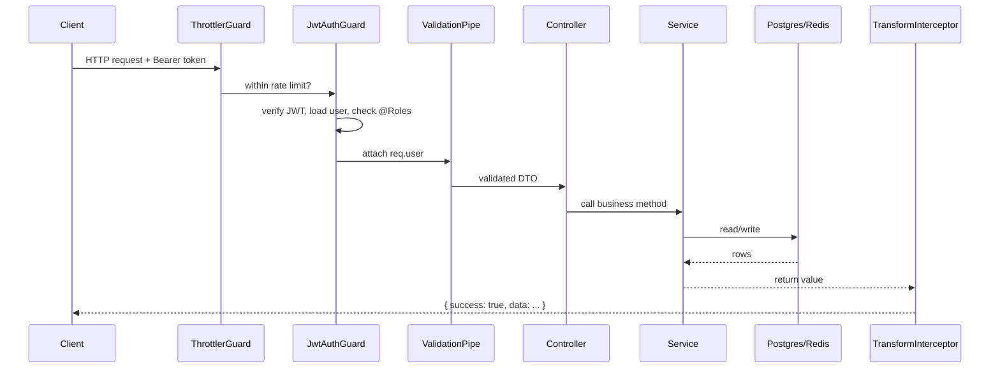
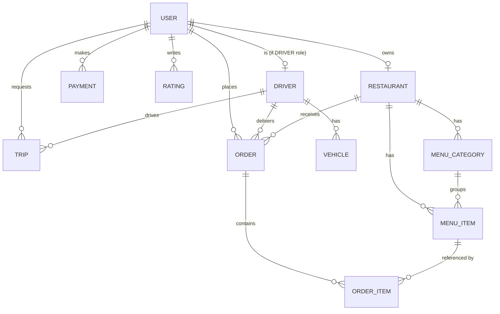
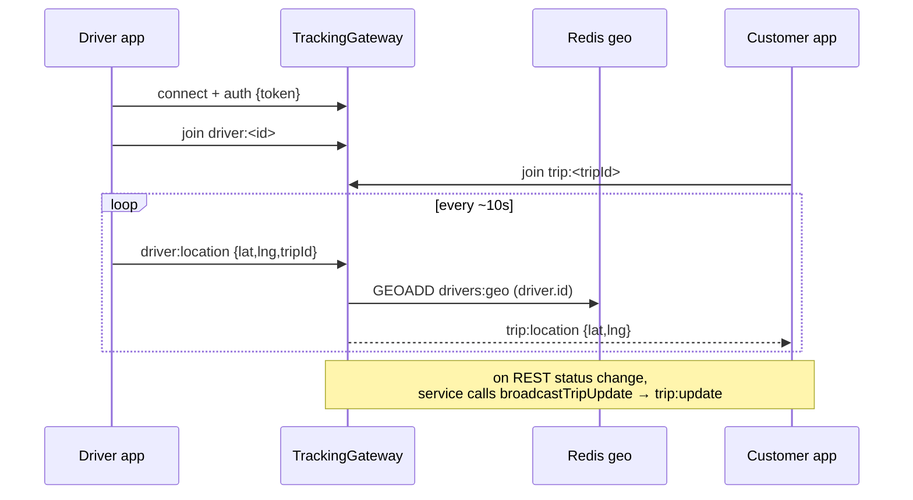
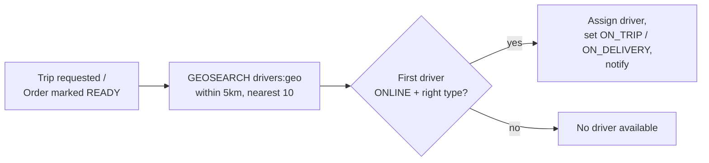
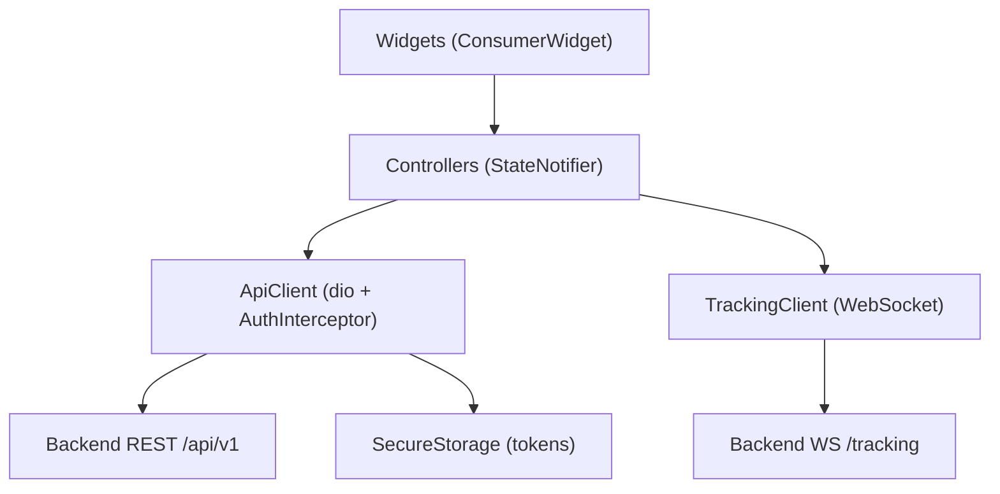
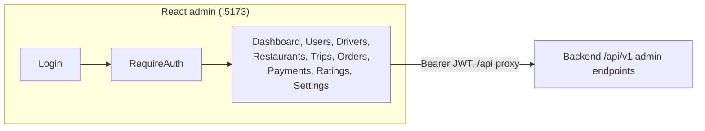
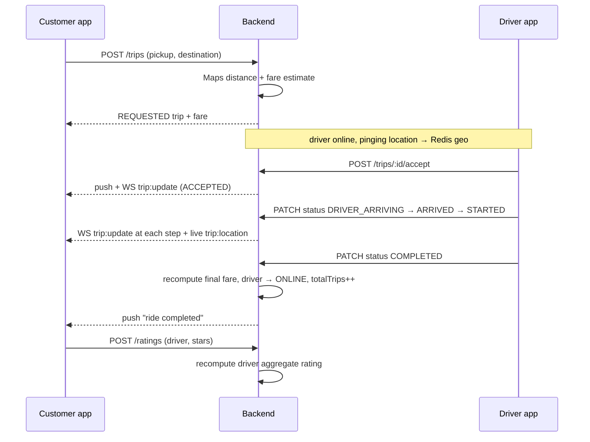
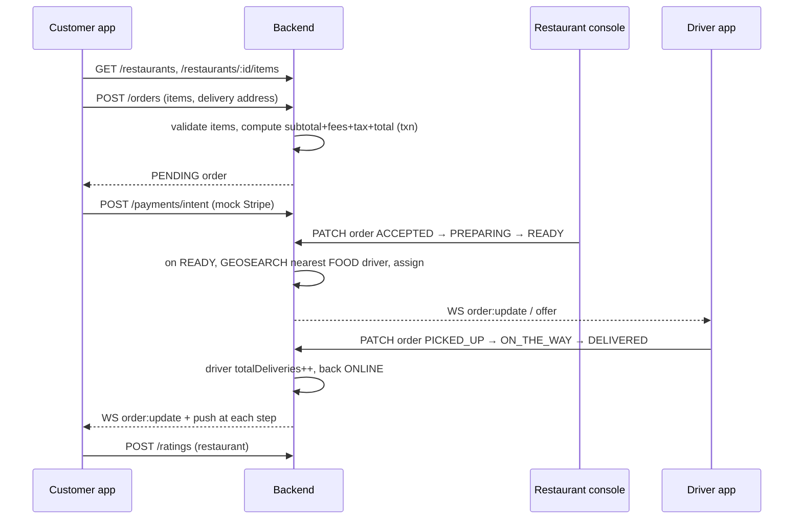

# GenY Super-App — Architecture Document

> A ride-hailing **and** food-delivery "super-app" (an Uber + Uber Eats / Careem + Talabat competitor), built as a monorepo of three applications sharing one backend.

**Audience:** engineers and technical stakeholders who need to understand how the whole system is put together and how each piece works, function by function.
**Status:** MVP. This document reflects the code as of the current `main` branch.

---

## Table of contents

1. [System overview](#1-system-overview)
2. [Technology stack](#2-technology-stack)
3. [Repository layout](#3-repository-layout)
4. [The backend: NestJS API](#4-the-backend-nestjs-api)
   - 4.1 [Bootstrap and the request lifecycle](#41-bootstrap-and-the-request-lifecycle)
   - 4.2 [Cross-cutting layer (guards, interceptor, filter)](#42-cross-cutting-layer-guards-interceptor-filter)
   - 4.3 [Configuration](#43-configuration)
   - 4.4 [Authentication & authorization model](#44-authentication--authorization-model)
   - 4.5 [The data model](#45-the-data-model)
   - 4.6 [Infrastructure services](#46-infrastructure-services)
   - 4.7 [Domain modules, function by function](#47-domain-modules-function-by-function)
   - 4.8 [Real-time tracking gateway](#48-real-time-tracking-gateway)
   - 4.9 [The driver-matching engine](#49-the-driver-matching-engine)
   - 4.10 [The fare model](#410-the-fare-model)
5. [The mobile app: Flutter](#5-the-mobile-app-flutter)
6. [The admin dashboard: React](#6-the-admin-dashboard-react)
7. [End-to-end flows across all apps](#7-end-to-end-flows-across-all-apps)
8. [Testing](#8-testing)
9. [Running the system](#9-running-the-system)
10. [Known issues & roadmap](#10-known-issues--roadmap)

---

## 1. System overview

GenY is composed of **three client-facing surfaces and one backend**:

| Component | Tech | Who uses it | Talks to backend via |
|---|---|---|---|
| **Backend API** | NestJS 10 (TypeScript) | — | — |
| **Mobile app** (`passenger_app/`) | Flutter | Customers, Drivers, Restaurant partners | REST + WebSocket |
| **Admin dashboard** (`admin_dashboard/`) | React 18 + Vite | Platform admins | REST |

A single Flutter binary serves **three** of the four roles (Customer, Driver, Restaurant) and routes each user to the correct experience after login based on their role. The React dashboard serves the fourth role (Admin). All four roles are defined once, on the backend, and every account has **exactly one** role.



**Design principle — graceful degradation.** Google Maps, Stripe, and Firebase are all optional. Each has a "mock mode": with no API key, Maps falls back to a haversine-distance calculation, Stripe returns simulated payment intents, and FCM becomes a no-op logger. This lets the entire product run end-to-end locally with zero external credentials.

**Two data stores, two jobs.** PostgreSQL is the system of record (users, trips, orders, payments, everything durable). Redis holds a **geospatial index of online drivers** for fast "nearest driver" queries, plus short-lived heartbeat keys. Losing Redis degrades matching but doesn't lose business data.

---

## 2. Technology stack

| Concern | Backend | Mobile app | Admin dashboard |
|---|---|---|---|
| Language | TypeScript 5 | Dart 3 | TypeScript 5 |
| Framework | NestJS 10 | Flutter 3.13+ | React 18 |
| Build | Nest CLI | Flutter tooling | Vite 5 |
| State / DI | Nest DI container | Riverpod | React hooks |
| Routing | Nest controllers | go_router | react-router-dom 6 |
| HTTP | — | dio | native fetch wrapper |
| Persistence | TypeORM 0.3 → PostgreSQL 14 | flutter_secure_storage (tokens) | localStorage (token) |
| Cache / geo | Redis 4 (node-redis) | — | — |
| Auth | `@nestjs/jwt` (self-contained guard) | JWT + refresh interceptor | JWT (Bearer) |
| Real-time | `@nestjs/websockets` + socket.io | web_socket_channel | — |
| Maps | Google Maps REST | google_maps_flutter, geolocator | — |
| Payments | Stripe SDK | flutter_stripe | (refund calls only) |
| Push | Firebase Admin | firebase_messaging | — |
| Rate limiting | `@nestjs/throttler` | — | — |
| API docs | Swagger / OpenAPI 3 | — | — |
| Tests | Jest (153 unit + live E2E) | flutter_test | — |

---

## 3. Repository layout

```
test02/                          # repo root = the NestJS backend
├── src/
│   ├── main.ts                  # bootstrap: pipes, filters, interceptors, Swagger, WS adapter
│   ├── app/
│   │   ├── app.module.ts        # root module — wires everything together
│   │   ├── config/              # typed config loaders + env validation
│   │   └── common/              # guards, decorators, filters, interceptors, base entity
│   ├── infra/                   # third-party integrations
│   │   ├── database/            # TypeORM module, data-source, seed script
│   │   ├── redis/               # geo index + cache
│   │   ├── google-maps/         # distance/fare + haversine fallback
│   │   ├── stripe/              # intents, refunds, webhook verification
│   │   └── fcm/                 # Firebase push
│   └── modules/                 # one folder per bounded context
│       ├── auth/  users/  drivers/  restaurants/  menu/
│       └── trips/  orders/  payments/  ratings/  notifications/  tracking/
├── scripts/
│   ├── smoke-test.mjs           # quick 13-check API smoke test
│   └── e2e-full.mjs             # 52-check live end-to-end suite (all modules)
├── passenger_app/               # Flutter mobile app (3 roles in one codebase)
│   └── lib/app/{core,data,modules}/
└── admin_dashboard/             # React admin dashboard
    └── src/{components,hooks,lib,pages}/
```

Each backend module is a self-contained bounded context: a `*.module.ts` (wiring), `*.controller.ts` (HTTP routes), `*.service.ts` (business logic), `dtos/` (validated request shapes), and `entities/` (TypeORM tables). Most also ship a `*.service.spec.ts` (Jest unit tests).

---

## 4. The backend: NestJS API

The backend is a conventional NestJS application organized in three layers:

- **`app/`** — the composition root and everything cross-cutting (config, guards, the global response envelope, the global exception filter).
- **`infra/`** — wrappers around external systems (Postgres, Redis, Google Maps, Stripe, Firebase). Domain code depends on these interfaces, never on the vendors directly.
- **`modules/`** — the eleven domain modules where the actual business rules live.

Base URL: `http://localhost:3000/api/v1`. Interactive API docs (Swagger) at `http://localhost:3000/docs`.

### 4.1 Bootstrap and the request lifecycle

`main.ts` builds and configures the application before it starts listening:

1. **Create the app** with CORS enabled.
2. **Global route prefix** `api/v1` (configurable via `API_PREFIX`).
3. **Global `ValidationPipe`** with `whitelist`, `forbidNonWhitelisted`, `transform`, and implicit type conversion. This means every request body is validated against its DTO, unknown properties are rejected, and query/param strings are coerced to their declared types.
4. **Global `AllExceptionsFilter`** — turns any thrown error into a uniform JSON error envelope.
5. **Global interceptors** — `ClassSerializerInterceptor` (honors `@Exclude()` so, e.g., password hashes never serialize) and `TransformInterceptor` (wraps success responses).
6. **WebSocket adapter** (`IoAdapter`) for the socket.io tracking gateway.
7. **`useContainer`** so `class-validator` can use Nest's DI (custom validators can inject services).
8. **Swagger** document builder with bearer-auth support.
9. **Listen** on the configured port.

A typical authenticated request flows like this:



If anything throws, the `AllExceptionsFilter` intercepts it and returns `{ success: false, statusCode, path, timestamp, message }` instead.

### 4.2 Cross-cutting layer (guards, interceptor, filter)

**`ThrottlerGuard`** (global) — rate-limits every route to **120 requests per 60 seconds** per client, configured in `app.module.ts`.

**`JwtAuthGuard`** (`app/common/guards/jwt-auth.guard.ts`) — the primary auth guard, applied per-controller with `@UseGuards(JwtAuthGuard)`. It is deliberately self-contained (no passport-jwt). On each request it:
1. Reads the `Authorization: Bearer <token>` header; rejects with 401 if missing.
2. Verifies the JWT signature/expiry using the configured secret.
3. Loads the user from the database and rejects if the account is missing or inactive.
4. Attaches `{ id, email, role }` to `req.user`.
5. Reads any `@Roles(...)` metadata on the handler/class and enforces it — a wrong-role user is rejected.

Because it both authenticates *and* enforces roles, the same class doubles as an authorization guard. (Because it needs the `User` repository, `AuthModule` exports `TypeOrmModule` so every module using the guard can inject it.)

**`RolesGuard`** (`roles.guard.ts`) — a lighter, roles-only guard kept for contexts where the JWT was already verified upstream (e.g. potential WebSocket use). It only checks `@Roles(...)`.

**`@Roles(...)` and `@CurrentUser()`** (`app/common/decorators/`) — a metadata decorator to declare required roles on a route, and a param decorator to pull the authenticated user into a handler argument.

**`TransformInterceptor`** — wraps every successful response body as `{ success: true, data: <body> }`. This gives all three clients one consistent envelope to unwrap.

**`AllExceptionsFilter`** — catches everything. `HttpException`s keep their status and message; any other error becomes a 500 and is logged with its stack. Output is always `{ success: false, statusCode, path, timestamp, message }`.

### 4.3 Configuration

Configuration is loaded through `@nestjs/config` with typed loader functions (`app/config/*.config.ts`) grouped under namespaces (`jwt.*`, `googleMaps.*`, `stripe.*`, database, app). An `env.validation.ts` schema validates required environment variables at startup, so the app fails fast on misconfiguration rather than at first use. Env files are read from `.env.local` then `.env`.

Key variables: `PORT`, `API_PREFIX`, the `DB_*` block, `JWT_SECRET` / `JWT_EXPIRES_IN`, `GOOGLE_MAPS_API_KEY`, `STRIPE_SECRET_KEY` / `STRIPE_WEBHOOK_SECRET`, the `FIREBASE_*` block, and `REDIS_HOST` / `REDIS_PORT`. Blank or placeholder values for Maps / Stripe / Firebase trigger the mock-mode fallbacks described earlier.

### 4.4 Authentication & authorization model

**Roles.** Four mutually-exclusive roles: `CUSTOMER`, `DRIVER`, `RESTAURANT`, `ADMIN`. One account = one role.

**Registration** (`AuthService.register`): checks email/phone uniqueness, hashes the password with bcrypt, creates the user, and — importantly — **refuses to create an `ADMIN` account through public registration** (a privilege-escalation guard; admins come only from the seed or another admin). If the role is `DRIVER`, it auto-creates a matching `Driver` profile (offline, unapproved). It then issues tokens.

**Login** (`AuthService.login`): looks the user up by email *or* phone (`identifier`), rejects if not found or inactive, verifies the password with bcrypt, and issues tokens.

**Tokens** (`issueTokens`): signs a JWT payload `{ sub, email, role }` twice — a short-lived **access token** and a longer-lived **refresh token** — and returns them alongside a small user summary.

**Refresh** (`AuthService.refresh`): verifies the refresh token and re-issues a fresh pair.

**`/auth/me`**: returns the current user (password hash excluded via `@Exclude()` + the serializer).

```mermaid
sequenceDiagram
    participant App
    participant Auth as AuthController/Service
    App->>Auth: POST /auth/login {identifier, password}
    Auth->>Auth: find by email or phone, bcrypt compare
    Auth-->>App: { accessToken, refreshToken, user }
    Note over App: store tokens; attach Bearer on every call
    App->>Auth: (later) 401 → POST /auth/refresh {refreshToken}
    Auth-->>App: new { accessToken, refreshToken }
```

### 4.5 The data model

Every table extends **`BaseEntity`**, which provides a UUID primary key and `created_at` / `updated_at` / `deleted_at` timestamps. `deleted_at` means **soft deletes** are used throughout — rows are hidden, not physically removed.



Entity highlights:

- **User** — email, phone (both unique), name, role, bcrypt `passwordHash` (excluded from serialization), optional `fcmToken`, `walletBalance`, `isActive`, `metadata` JSONB. Lower-cases email on insert.
- **Driver** — one-to-one with User; `status` (`OFFLINE`/`ONLINE`/`ON_TRIP`/`ON_DELIVERY`), `type` (`RIDE`/`FOOD`/`BOTH`), current lat/lng, aggregate `rating`, `totalTrips`, `totalDeliveries`, `isApproved`, `lastSeenAt`. Has many Vehicles.
- **Vehicle** — plate (unique), make/model/year/type/color/capacity, `isVerified`.
- **Restaurant** — owner (User), contact info, `status` (`OPEN`/`CLOSED`/`BUSY`), location, aggregate rating + count, delivery fee, minimum order, prep-time estimate, cuisine types, opening hours, `isActive`.
- **MenuCategory** / **MenuItem** — items carry price, availability, dietary flags (vegetarian/vegan/gluten-free), prep time, discount.
- **Trip** (ride-hailing) — customer, optional driver, `status` (`REQUESTED → ACCEPTED → DRIVER_ARRIVING → DRIVER_ARRIVED → STARTED → COMPLETED`, or `CANCELLED`), `type` (`RIDE`/`PARCEL`), pickup/destination coords + addresses, distance/duration, fare estimate & final fare, surge multiplier, polyline, timestamps for each transition.
- **Order** (food) — customer, restaurant, optional driver, `status` (`PENDING → ACCEPTED → PREPARING → READY → PICKED_UP → ON_THE_WAY → DELIVERED`, or `CANCELLED`/`REJECTED`), payment method, the full money breakdown (subtotal, delivery fee, service fee, tax, discount, total), delivery address/coords, ETA, per-transition timestamps.
- **OrderItem** — line items: menu item, quantity, unit price, special instructions, line total.
- **Payment** — user, purpose (`TRIP`/`ORDER`), reference id, provider intent id, amount, currency, `status` (pending/succeeded/failed/refunded/partially-refunded).
- **Rating** — reviewer, target (`DRIVER`/`RESTAURANT`), target id, stars (1–5), title/comment/tags, optional reference to the trip/order.

> **Note on schema management:** the app runs with TypeORM `synchronize: true` for the MVP (tables are auto-created from entities). This is convenient locally but unsafe in production; migrations are the intended path (`migration:generate` / `migration:run`).

### 4.6 Infrastructure services

**RedisService** (`infra/redis/redis.service.ts`) — thin wrapper over node-redis v4, connected on module init. Beyond `set`/`get`/`del` (with optional TTL) it provides the geo helpers that power matching:
- `addGeo(key, lng, lat, member)` → `GEOADD`.
- `nearby(key, lng, lat, radiusKm, count)` → `GEOSEARCH` sorted ascending by distance, returning member ids (with distance when requested).
- `removeGeo(key, member)` → removes a driver from the index.

**GoogleMapsService** (`infra/google-maps/google-maps.service.ts`) — wraps Distance Matrix, Directions, and Geocoding over native `fetch`. In **mock mode** (no key), every call returns deterministic geometry computed from a **haversine** great-circle distance, with duration derived at ~30 km/h. Its `estimateFare(...)` implements the pricing formula (see §4.10). This is the single source of both ETAs and fares.

**StripeService** (`infra/stripe/stripe.service.ts`) — wraps PaymentIntents, refunds, and webhook signature verification. In **mock mode** (`sk_test_xxx` or blank), `createPaymentIntent` returns a fake `pi_mock_…` id + client secret, and `refund` returns a fake refund — so the payments flow is fully exercisable without a Stripe account.

**FcmService** (`infra/fcm/fcm.service.ts`) — wraps Firebase Admin messaging. If the `FIREBASE_*` env block is absent it initializes in **no-op mode**, logging what it *would* have sent. `sendToToken` / `sendToTopic` are the entry points.

### 4.7 Domain modules, function by function

#### auth
Covered in §4.4. Controller exposes `POST /auth/register`, `POST /auth/login` (returns 200), `POST /auth/refresh` (returns 200), `GET /auth/me` (guarded).

#### users
`UsersService` — `findAll` (admin list, newest first), `findOne`, `findByEmailOrPhone`, `update`, `deactivate` (sets `isActive=false`), `setFcmToken`, `updateWallet` (atomic increment). Controller: `GET /users/me`, `PATCH /users/me`, `DELETE /users/me` (self-deactivate), `GET /users` (admin), `GET /users/:id`.

#### drivers
`DriversService` manages driver state and the geo index. Key methods:
- `findByUserId` / `findOne` / `list` — lookups (list is the admin view).
- `update` — patch status/type.
- `goOnline(userId)` — requires `isApproved`; sets status `ONLINE`, stamps `lastSeenAt`, and **adds the driver to the Redis geo index** at their last known position.
- `goOffline(userId)` — sets `OFFLINE`, deletes the ping heartbeat key, and **removes the driver from the geo index**.
- `pingLocation(userId, dto)` — the 5–10s heartbeat: rejects if offline, updates the DB position + `lastSeenAt`, re-adds to the geo index, and writes a 30-second TTL `driver:ping:<id>` key used as a liveness signal.
- `nearby(lat, lng, radiusKm, count)` — the map query: runs the Redis geo search, loads those drivers, and returns id + position + rating + type + distance.
- Vehicles: `addVehicle` (unique plate), `listVehicles`, `verifyVehicle` (ownership-checked).

Controller routes cover `/drivers/me` (get/patch), `/drivers/me/online`, `/drivers/me/offline`, `/drivers/me/ping`, `/drivers/nearby`, the `/drivers/me/vehicles` set, and admin `GET /drivers`.

#### restaurants
`RestaurantsService` — `create` (owner = caller), `findAll` (public, active-only, filterable by name/cuisine, ordered by rating), `findOne`, `findByOwner` (the partner's own restaurant), `assertOwned` (authorization helper reused by the menu module), `update`, `remove` (soft delete), `setStatus`. Controller ordering matters: `GET /restaurants/me` is declared **before** `GET /restaurants/:id` so the literal path isn't captured as an id.

#### menu
`MenuService` — category and item CRUD, each write guarded by `restaurants.assertOwned(...)` so only the owning restaurant (or an admin) can modify a menu. `createItem` also verifies the target category belongs to that restaurant. Reads (`listCategories`, `listItems`) are public and eager-load their relations. Nested under `restaurants/:restaurantId/{categories,items}`.

#### trips (ride-hailing)
`TripsService` is the ride state machine:
- `requestTrip(customerId, dto)` — asks Maps for distance/duration, computes a fare estimate, and persists a `REQUESTED` trip with the estimate and route metadata.
- `acceptTrip(driverUserId, tripId)` — validates the driver is approved, online, and the trip is still `REQUESTED`; assigns the driver, moves to `ACCEPTED`, flips the driver to `ON_TRIP`, notifies the customer (push + WS), and broadcasts an offer ack.
- `updateStatus(actorUserId, tripId, dto)` — enforces the transition rules: **only the assigned driver** may set `DRIVER_ARRIVING`, `DRIVER_ARRIVED`, `STARTED`, or `COMPLETED`; the customer (or driver) may `CANCEL`. On `COMPLETED` it recomputes the final fare from actual distance, returns the driver to `ONLINE`, increments `totalTrips`, and pushes a "ride completed" notification. Every transition broadcasts a `trip:update` over WebSocket.
- Lookups: `listAll` (admin), `getActiveForCustomer`, `getActiveForDriver`, `findOne`.
- `findNearestDriverForTrip(trip)` — the matching query (see §4.9).

#### orders (food delivery)
`OrdersService` is the delivery state machine and the most complex service:
- `create(customerId, dto)` — validates the restaurant is open and all items exist, are available, and belong to that restaurant; computes the money breakdown (subtotal from line items, distance-based delivery fee, 5% service fee, 5% tax, total); enforces the restaurant minimum order; and persists the order **and its line items in a single transaction**.
- `updateStatus(actorUserId, orderId, dto, isAdmin)` — role-aware transitions. The **customer** may cancel (only before pickup). The **restaurant owner** may set `ACCEPTED`/`PREPARING`/`READY`/`REJECTED`; when an order flips to `READY`, the service **auto-assigns the nearest available food driver** (see §4.9) and marks that driver `ON_DELIVERY`. The **assigned driver** may set `PICKED_UP`/`ON_THE_WAY`/`DELIVERED`; on `DELIVERED` it increments the driver's `totalDeliveries` and returns them to `ONLINE`. Each transition broadcasts an `order:update` and notifies the customer.
- Lookups: `listAll` (admin), `listMine` (customer), `listForRestaurant` (ownership-checked), `listForDriver`, `findOne`.
- `assignDriver(orderId, lat, lng)` — the food-matching query.

#### payments
`PaymentsService` — `createIntent` (creates a Stripe intent via the wrapper, records a `PENDING` payment row, returns the `paymentId` + client secret), `listAll` (admin), `getOne`, `findByReference`, `refund` (full or partial, updates status), and webhook handling: `handleWebhookEvent` verifies the Stripe signature and marks payments succeeded/failed. The webhook lives on a **separate, unguarded controller** (`payments/webhook`) because it's authenticated by Stripe signature, not JWT.

#### ratings
`RatingsService` — `create` persists a 1–5 star rating and then **recomputes the target's aggregate**: for a driver it updates `Driver.rating`; for a restaurant it updates `Restaurant.rating` and `ratingCount`, both via `AVG`/`COUNT` query. `findByTarget` and `findByReviewer` list ratings.

#### notifications
`NotificationsService` — `sendToUser` resolves the user's FCM token from the DB and dispatches via `FcmService` (skipping gracefully if the user has no token); `sendToTopic` broadcasts. This is the seam every other module calls to push a notification.

#### tracking
The WebSocket gateway — see §4.8.

### 4.8 Real-time tracking gateway

`TrackingGateway` (`modules/tracking/tracking.gateway.ts`) is a socket.io gateway on the `tracking` namespace. It gives customers a live view of their driver and gives services a way to push status changes.

**Rooms:** `trip:<id>`, `order:<id>`, `driver:<id>`.

**Connection & auth:** on connect, a client may pass a JWT via the socket handshake; the gateway verifies it and stamps `userId`/`role` onto the socket. Clients can also (re)authenticate later with an `auth` message.

**Inbound messages:**
- `auth { token }` — authenticate the socket.
- `join { room }` — subscribe to a trip/order/driver room.
- `driver:location { lat, lng, heading?, tripId?, orderId? }` — a driver pushes its position. The gateway resolves the driver's **`driver.id`** (cached per socket) and writes it into the Redis geo index — using the *same* member id the REST ping endpoint uses, so both paths keep one consistent index — then relays the position to the driver's room and any referenced trip/order rooms.

**Server→client events** (emitted by services): `trip:update`, `trip:location`, `order:update`, `order:location`, `driver:offer`. The `broadcastTripUpdate` / `broadcastOrderUpdate` / `broadcastDriverOffer` helpers are what `TripsService` and `OrdersService` call.



### 4.9 The driver-matching engine

Matching is powered entirely by the Redis geo index that the drivers module and tracking gateway keep current.

**For rides** (`TripsService.findNearestDriverForTrip`): run `GEOSEARCH drivers:geo` around the pickup within 5 km (nearest 10), load those drivers, and pick the first that is `ONLINE` and whose type is `RIDE` or `BOTH`.

**For food** (`OrdersService.assignDriver`, triggered when an order hits `READY`): the same geo search around the restaurant, picking the first `ONLINE` driver whose type is `FOOD` or `BOTH`, then marking them `ON_DELIVERY` and attaching them to the order.



> The current engine is **synchronous and single-shot** — it offers to the single nearest eligible driver inline within the request. The roadmap calls for an async engine (BullMQ) with cascade offers and accept timeouts.

### 4.10 The fare model

Fares use an Uber-style linear formula, implemented in `GoogleMapsService.estimateFare`:

```
fare = (baseFare + perKm × km + perMin × min) × surge
     = (2.50    + 1.20  × km + 0.25   × min) × 1.0
```

`km` and `min` come from the Distance Matrix result (or the haversine fallback in mock mode). Surge is currently hard-coded to `1.0`; the intended production behavior is to derive it from the ratio of active requests to nearby online drivers (data Redis already holds). The estimate is stored on the trip at request time; the **final fare is recomputed from actual distance on completion**.

---

## 5. The mobile app: Flutter

`passenger_app/` is a single Flutter codebase that serves **Customers, Drivers, and Restaurant partners**, routing each to the right experience after login.

**Architecture & stack.** Layered and Riverpod-driven: UI widgets watch Riverpod providers → controllers (`StateNotifier`s) hold feature state → a typed `ApiClient` (over dio) and a `TrackingClient` (WebSocket) talk to the backend. Tokens live in `flutter_secure_storage`. Routing is a single `go_router` instance whose redirect logic enforces auth and role gating.

**Bootstrap** (`main.dart`): initializes Firebase (optional/try-catch), sets the Stripe key only if present, and runs the app inside a `ProviderScope`. Every route is wrapped in an `FcmRegistrar` that fetches the device FCM token and, once authenticated, pushes it to `PATCH /users/me`. Foreground push messages surface as snackbars.

**Routing & role gating** (`app/core/router/app_router.dart`): starts at `/splash` while the session is restored, then redirects. Unauthenticated users are forced to `/login`; authenticated users are sent to their role home — `/passenger`, `/driver`, `/restaurant`, or `/admin`. Role-locked shells bounce a user who tries to reach another role's area. The passenger and driver homes are `ShellRoute`s with a bottom navigation bar (home / history / profile tabs); the router re-evaluates on every auth-state change via a `refreshListenable`.

**Data layer:**
- `ApiClient` (`app/data/services/api_client.dart`) — a typed method per backend endpoint (login, register, refresh, me; user profile; driver online/offline/ping/nearby/vehicles; restaurants & menu CRUD; trips request/accept/status/list; orders create/status/list; payment intent; ratings). It centrally unwraps the `{ success, data }` envelope and maps errors to a typed `AppFailure`. Its `AuthInterceptor` attaches the Bearer token and, on a 401, performs a **single-flight token refresh** (queuing concurrent requests, replaying them after refresh, and clearing storage if refresh fails).
- `SecureStorage` — namespaced `geny.*` keys for access/refresh tokens, role, user identity, and FCM token; `clearAll()` on logout.
- `TrackingClient` — connects to the WebSocket, sends an `auth` frame with the token, exposes a broadcast stream of `{event, data}`, offers `join(room)` and `sendDriverLocation(...)`, keeps a heartbeat, and auto-reconnects.

**Controllers (feature logic):**
- `AuthController` — the login/register/logout/session-restore state machine; every transition notifies the router.
- `DriverHomeController` — `goOnline` (calls the API, connects the socket, subscribes to offers, starts a 10s geolocation ping loop that hits *both* the REST ping and the WS location), `goOffline`, `acceptTrip`, `updateTripStatus`, `advanceOrder` (walks a delivery `PICKED_UP → ON_THE_WAY → DELIVERED`), and offer handling.
- `FoodCartController` — in-memory cart math (add/increment/decrement, subtotal, `toApiItem()` shaping for `POST /orders`).
- `RestaurantController` — loads the partner's restaurant, its incoming orders, and its menu; advances order status; and does full menu CRUD (each mutation re-fetches).
- `PassengerHomePage` — a Google Map centered on the user, loads nearby drivers as markers, and hosts the ride-request sheet (pickup/destination → fare estimate → place trip).
- `historyStreamProvider` — a `FutureProvider.family` returning trips / orders / deliveries for the history tabs.



---

## 6. The admin dashboard: React

`admin_dashboard/` is a React 18 + Vite SPA for the **Admin** role. In development, Vite runs on **:5173** and proxies `/api` → `http://localhost:3000`, so no CORS or base-URL config is needed.

**Routing** (`src/App.tsx`): a public `/login`, and everything else nested under a `RequireAuth` → `AdminLayout` boundary. Pages: Dashboard (index), Users, Drivers, Restaurants, Trips, Orders, Payments, Ratings, Settings. Unknown paths redirect to the root (which redirects to login if unauthenticated).

**Auth** (`src/hooks/useAuth.ts` + `src/lib/api.ts`): login calls `POST /auth/login`, stores the JWT in `localStorage` under `geny.admin.token`, and **rejects any non-ADMIN account client-side**. On mount it restores the session via `GET /auth/me` (again ADMIN-gated). Every request attaches `Authorization: Bearer <token>`; a global `401` handler clears the token and redirects to `/login`. (Server-side authorization is the real boundary; the client gate is UX.)

**API client** (`src/lib/api.ts`): `listUsers`, `listDrivers`, `listRestaurants(filter?)`, `updateRestaurant`, `deleteRestaurant`, `listTrips`, `listOrders`, `listPayments`, `refund`, `listRatings(target, targetId)`. A `unwrapList` helper tolerates both bare arrays and keyed envelopes.

**Layout** (`src/components/AdminLayout.tsx`): a sidebar shell with an "Operate" section (the eight data pages) and a "System" section (Settings), plus a sign-out footer.

**Dashboard** (`src/pages/dashboard/DashboardPage.tsx`): there is **no server-side aggregation endpoint** — the dashboard fetches the list endpoints (`/users`, `/drivers`, `/restaurants`, `/orders`) and computes KPIs in the browser: total users, driver count, active trips (drivers whose status is on-trip/on-delivery), active orders (any in-progress status), and gross revenue (sum of delivered-order totals).



The dashboard is intentionally **read-mostly**: nearly every page is a GET list; the only writes are restaurant edit/delete and payment refund.

---

## 7. End-to-end flows across all apps

### A ride, start to finish



### A food order, start to finish



The **admin dashboard** observes all of this after the fact through the read-only list endpoints, computing platform KPIs from the raw lists.

---

## 8. Testing

Two complementary layers:

- **Unit tests (Jest)** — 153 service specs across every module, run with `npm test`. They mock the database and exercise business logic in isolation (fast, no infrastructure).
- **Live end-to-end suite** — `scripts/e2e-full.mjs` (52 checks) drives real HTTP + WebSocket traffic against a running server with real Postgres + Redis, covering the full ride and delivery lifecycles, authorization negative cases, payments, ratings, and the tracking gateway. `scripts/smoke-test.mjs` is a lighter 13-check version.

Because the unit tests mock persistence, they don't catch integration issues (wiring, SQL, relation mapping, route ordering) — that's the job of the E2E suite. Both are green on the current `main`.

---

## 9. Running the system

```bash
# 1. Infrastructure (Postgres + Redis)
docker compose up -d

# 2. Backend
npm install
cp .env.example .env          # blank Maps/Stripe/Firebase keys = mock mode
npm run start:dev             # http://localhost:3000, Swagger at /docs
npm run seed                  # 4 demo accounts (password: P@ssw0rd)

# 3. Mobile app
cd passenger_app
flutter pub get
flutter run                   # override API with --dart-define=API_BASE_URL=...

# 4. Admin dashboard
cd admin_dashboard
npm install
npm run dev                   # http://localhost:5173 (proxies /api to :3000)
```

Seed accounts (all password `P@ssw0rd`): `admin@geny.app`, `customer@geny.app`, `driver@geny.app`, `burgers@geny.app` (owns "GenY Burger House" and its menu).

---

## 10. Known issues & roadmap

**Intentionally out of MVP scope** (from the project roadmap): BullMQ async matching with cascade offers, multi-driver bidding, real surge pricing, scheduling / ride-pooling, S3/Cloudinary image uploads, driver KYC, multi-language/currency, and Kubernetes manifests.

**Notable current gaps to be aware of:**
- **Authorization returns 401 where 403 is more correct** — the shared guard throws `Unauthorized` for a wrong-role (but authenticated) user.
- **`synchronize: true`** is enabled for the MVP; production should disable it and use migrations.
- **Synchronous, single-shot matching** — no offer timeout or cascade yet.
- **Surge is hard-coded to 1.0.**
- On the **Flutter client**, a few real-time refinements remain: the driver app doesn't join the `trip:<id>` room after accepting (so live trip location relies on the ping loop carrying a `tripId`), the WebSocket auto-reconnect flag isn't re-armed after a manual disconnect, and the restaurant console polls rather than subscribing to live order pushes.
- On the **admin dashboard**, KPIs are computed by fetching entire list endpoints and counting client-side (won't scale), the payments list endpoint is thin, and a few dashboard deltas are placeholder strings.

---

*Generated from a full read of the backend, Flutter app, and admin dashboard source.*
